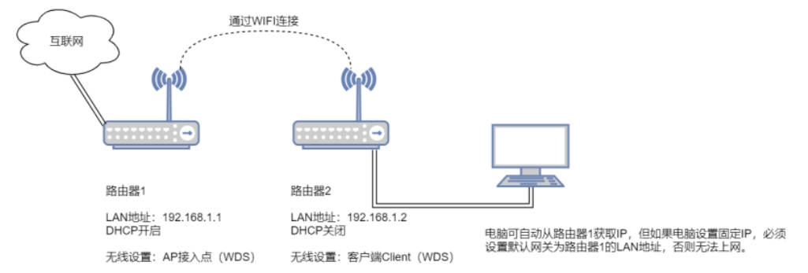

## 概念
- WDS是一种设备工作模式，可以使无线AP或者无线路由器之间通过无线进行桥接实现`无线分布系统`

## 网络拓扑
  
- 1、两个路由器都需要使用WDS，路由器`R1`的wifi需要设置为`AP接入点（WDS）`，路由器`R2`的wifi设置为`客户端Client（WDS）`，SSID名称、加密方式、密码需相同。
- 2、`关闭路由器R2的dhcp`，lan侧地址设置为与路由器R1lan侧`同网段`的静态地址地址（`这里是因为数据包后续会从R2的无线口以空气包的形式到R1，不走wan物理口，可以理解为 STA --> R2-LAN --> R1-LAN --> R1-WAN`）

## 无线桥接成功后
### 有线网络
- `有线接口(如LAN端口)将通过无线桥接连接成功获取DHCP地址。`
- 注意，此时`远端客户端网桥设备（R2）`的无线网络`自身却不会获取到IP`地址，因为`它作为透明网桥被使用`。
- `通过LAN端口`连接远端客户端网桥设备的`有线设备`此时已经经由`无线连接`透明网桥`至主网络`了。

### 无线网络
- 需要`新建一个AP节点`，SSID可以和上级路由器一样(实现`透明漫游`)，也可以不一样
- 连接至此接入点的无线设备就自动成为了网络的一部分。
