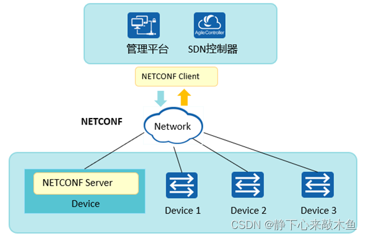
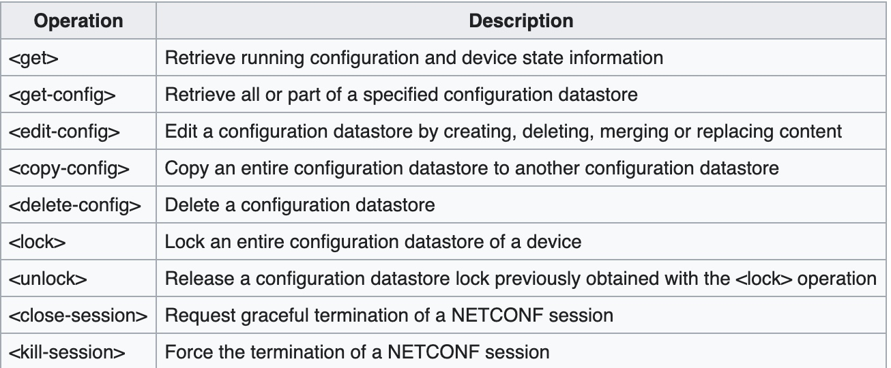

## 概念
- NETCONF（Network Configuration Protocol）是`基于可扩展标记语言XML`（Extensible Markup Language）的`网络配置和管理协议`，使用简单的`基于RPC（Remote Procedure Call）机制`实现客`户端和服务器之间通信`。

- NETCONF提供了一种通过运行网络管理软件的中心计算机（即网络管理工作站）来远程管理和监控设备的方法。

- 它`为网络设备的管理和配置`提供了一个`统一、标准化的接口`。通过这个接口，网络管理员`可以跨越不同厂商的界限`，实现`对网络设备的高效管理`。

- NETCONF（Network Configuration Protocol）网络配置协议，提供一套管理网络设备的机制。用户可以使用这套机制`增加、修改、删除网络设备的配置`，`获取网络设备的配置和状态信息`。

- NETCONF有三个对象  
  
- NETCONF客户端、NETCONF服务器、NETCONF消息

## 特点
- Netconf工作在SSH协议之上（通过SSH进行加密），可以下发配置给网路设备
- Netconf有标准的数据模型，统一数据格式，可以使得所有厂商都可以识别
- Netconf相比CLI设备识别会更快速，可以兼容不同的厂商
- Netconf是面向业务的，支持网络级的配置和多设备配置协同
- Netconf会区分状态数据和配置数据

## Netconf协议架构
- Netconf协议在概念上可以划分为4层：安全传输层、消息层、操作层、内容层
- 出错了才会发送notification  

---------------------------
1、内容层：
- 这一层包含了以 XML 或 JSON 格式的配置数据，也就是想对设备进行管理的具体内容。（由 XSD 或者 YANG 约束生成）

2、操作层：
- 定义了 Client 和 Server 交互时的一系列操作方法，用于获取或修改配置数据。  

3、消息层：
- 为编码数据时，提供了一种 RPC 和通知的机制：RPC的框架与传输层独立，用于表示Netconf requests和response

4、安全传输层：
- NETCONF 使用 SSH 或 TLS 协议，保证数据在 Client 和 Server 传输的安全性。

## Netconf配置设备流程
- 向Yang建模文件中填充数据，将其转为XML格式下发到设备进行设备配置
- 因为Yang语言`只定义了模型`，没有数据，要生成数据就需要变为XML格式（<>）
- 即将数据填充到Yang模型中，将其转变为XML格式（`Yang转XML`）
- XML类似于Html，是一种扩展的标记语言

## YANG模型是什么
- YANG是`专门为NETCONF协议设计`的`数据建模语言`
- 用来为NETCONF协议设计可操作的配置数据、状态数据模型、远程调用（RPCs）模型和通知机制等
- Yang是一个`建模的语言`，只有框架，没有具体的数据，`用来描述`Netconf的`内容层的结构`
- NETCONF 1.0对模型语言没有要求，NETCONF1.1明确了与YANG结合，开始规范NETCONF内容格式。
- 虽然指定了标准的Yang，但是`每个厂商都有自己私有的Yang`，在使用Netconf配置时并未完全统一
- 设备里面会内置了很多的Yang模型，`不同的Yang模型只表示内容层不一样`，其他层是一样的

## Netconf优势
- NETCONF协议`以XML格式定义消息`，运用`RPC机制修改配置信息`，这样既能`方便管理配置信息`，又能满足`来自不同制造商设备之间的互操作性`。
- 可`减少由于人工配置错误引起的网络故障`。
- `扩展性好`，不同制造商设备可以定义自己的协议操作，以实现独特的管理功能。
- NETCONF提供了认证、鉴权等安全机制，`保证了消息传递的安全`。
- `拓展性强`，在其协议内部分为 4 层，`各层之间相互独立`
- 易使用，结合提供的 API，实现可编程性的网络操作
- `安全性更好`，在传输层可选用 `SSH协议等。

## 相关文档
- https://blog.csdn.net/m0_49864110/article/details/128512756
- https://support.huawei.com/enterprise/zh/doc/EDOC1100367103/4389bc2f

