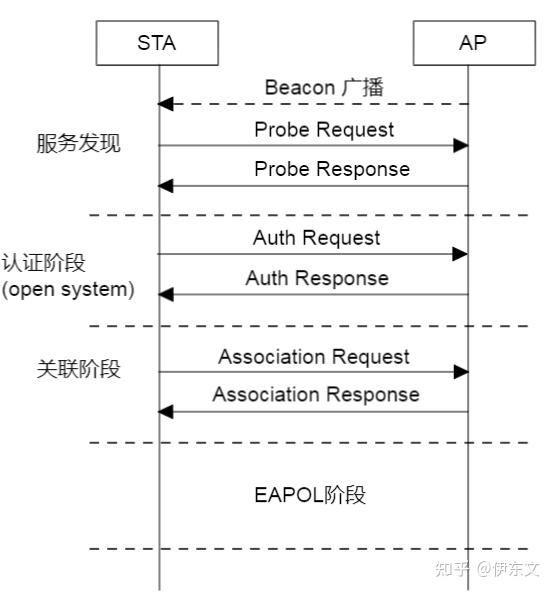

##  1、socket流程剖析？
### 描述两个应用进程之间的端到端的通信需要什么？
- 显然需要`五元组：本地IP、本地端口、远程IP、远程端口和协议`。而接下来要讲的套接字，它的本质就是涵盖着五元组信息的类/对象。其操作也大多围绕这五元组信息展开的。
### socket流程
#### 一、socket()函数——“亚当夏娃”套接字的诞生
- 使用socket()函数建立套接字的时候，我们`实际上是在内核`里面建立了一个`数据结构`(或者说是对象)。这个数据结构`包括`了上面所说的`地址`，此外还有`协议等条目`(只不过刚建立的时候这些条目还未指定具体值而已!)。
- socket()函数执行成功的话返回一个`int型的描述符`，它指向前面那个被维护在内核里的socket数据结构。我们的任何操作都是通过这个描述符而作用到那个数据结构上的。
- 由此，我们知道socket结构体`不仅仅`记录了`本地的IP:端口号`，还记录了`目的IP:端口`，即`“本地地址”和“远程地址”`。
- 也就是说`socket在新建的时候`只是一个`待填充的空的结构`，后面的`connect()`和`bind()`函数实际上可以看做`给内核里边`的那个`socket对象`设置`具体IP和端口信息`的过程。

#### 二、bind()和connect()函数——给套接字赋予“本地地址”(对客户端是“远程地址”)
- 依照建立套接字的目的不同，`赋予套接字地址`的方式有两种：`服务器端`使用`bind`，`客户端`使用`connect`
- 1、对于`服务端`而言， bind()函数的作用是将标注有socket地址信息的数据结构(struct sockaddr)和socket()函数创建的那个套接字联系起来，即`赋予这个套接字`一个`“本地地址”`(通常称为命名socket)。对于客户端通常不需要命名socket，而是采用匿名方式，即使用操作系统自动分配的socket地址。
- 2、对于`客户端`而言，connect()函数的作用是将客户端socket()函数建立socket和其所期望连接的服务器之间建立关系。只不过这个服务器是用标注相应信息的结构对象（struct sockaddr对象）来表征的。注：（1）作为客户端，你`想要连接的服务器的地址肯定是已经知道了`的。（2）在connect建立socket和socket地址两者关系的同时，它也在尝试着建立远端的连接。
- 总的来说，就是`将客户端socket()建立的socket同服务端的地址绑定`。

#### 三、listen()函数——开始监听的开关
- listen函数的作用可以理解成`开启监听的开关`，
- listen被执行之后开关被打开，就开始监听了。轮询的时候`判断到有连接请求过来的时候`调用`accept接受`即可。具体地讲使用listen系统调用后会`创建一个监听队列`以存放`待处理的客户连接`。

#### 四、accept函数——建立套接字连接
- accept()`接受一个客户端的连接请求`（该客户端的所有信息均来自“监听socket”），并返回一个`新的套接字`。
-所谓“新的”就是说这个套接字与`最开始socket()`调用时候返回的`用于监听和接受客户端的连接请求的套接字`不是同一个套接字。
- 与`本次接受的客户端的通信`是都是`通过`这个`新的套接字`上`发送和接收`数据来`完成`的。
- `再次调用accept()`可以接受`下一个客户端的连接请求`，并`再次返回`一个`新的套接字`（与socket()返回的套接字、之前accept()返回的套接字都不同的新的套接字）。
- 假设`一共有三个客户端`连接到服务器端。那么在`服务器端`就`一共有4个套接字`：第1个是`socket()返回`的、`经过bind或connect填充“本地IP：端口”`的`用于监听`的套接字；其余3个是`分别调用3次accept()返回`的`包含“本地/远程”`双重信息的`不同的套接字`（他们之间`远程信息不同`）。
- 如果已经有客户端连接到服务器端，`不再需要监听和接受更多的客户端连接`的时候，可以`关闭由socket()返回的套接字`，而`不会影响与客户端之间的通信`。
- 当某个`客户端断开连接`、或者是`与某个客户端的通信完成`之后，`服务器端`需要`关闭用于与该客户端通信的套接字`。
- 至此`为什么只有这个新的套接字才能用于同这次接受的客户端之间的通信`也就一目了然了，因为`这个套接字才真正包含`了`“本地信息”和“远程信息”`，只有`同时包含这两重信息才可以用于数据的收发`。
---------------------------------
##  2、accept()返回的fd和socket()返回的fd是否是同一个fd？
### 不是t同一个一个fd
### accept()的返回值:成功则返回一个`新的fd`，这个fd`用来和对端进行通信`；失败则返回-1，并且设置errno；
- 一个客户端和一个服务端连接，双方socket产生各自的c_sock_fd和s_sock_fd；
- s_sock_fd进行bind和listen后，accept准备接受客户端的连接请求；c_sock_fd调用connect请求连接服务端；
- `服务端接到请求产生accept_fd`，届时`accept_fd和c_sock_fd两个套接字可以通讯`，而`s_sock_fd则可以关闭`；
- ps：`服务端的socket`产生的套接字`只是用来监听`的，`不能直接`用于`发送接收数据`。

---------------------------------
##  3、Makefile中的 =、:=、?=、+= 分别起什么作用？
- = ———— 最后赋值，将整个 Makefile 展开后，再决定变数的值。变量的值是`整个makefile中最后被指定的值`，`在Makefile的整个执行过程中都是可变的`。例子：
```
x = foo
y = $(x) bar
x = xyz
# y 的值为 xyz bar

```
- := ———— 立即赋值，表示直接赋值，赋予当前位置的值。`变量的值一旦被赋值，就不再改变`:
```
x := foo
y := $(x) bar
x := xyz

# y 的值为 foo bar
```

- ?= ———— 默认赋值，如果该变量没有被赋值，则赋予等号后的值：
```
VIR := old_value
VIR ?= new_value

这种情况下，VIR的值就是old_value
```

- += ———— 追加赋值，将等号后面的值添加到前面的变量上：
```
VIR = foo
VIR += bar

VIR最后结果为foobar.
```
---------------------------------

## 4、C中static关键字的作用？
- 定义`全局`静态变量：
    - a.在全局区分配内存。
    - b.如果`没有初始化，其默认值为0`.
    - c.该变量在`本文件`内`从定义开始到文件结束可见`。
- 定义`局部`静态变量：
    - a.该变量`在全局数据区分配内存`。
    - b.它`始终驻留`在全局数据区，`直到程序运行结束`。
    - c. 其`作用域为局部作用域`，当`定义它的函数或语句块结束`时，其`作用域随之结束`。
- 定义静态`函数`：
    - a.静态函数`只能在本源文件中使用`
    - b.在文件作用域中声明的`inline函数默认为static类型`

---------------------------------

## 5、简单说说I/O多路复用？
- IO多路复用是一种有效的系统调用策略，它允许`单个线程`监视`多个文件描述符`，等待`一个或`多个输入/输出`(I/O)通道`变得`就绪`，也就是说，它们可以执行`无阻塞的读写操作`。
- `传统的同步I/O`操作要求`执行一个系统调用来完成一个操作`，比如读取或写入数据。当`操作阻塞`时（例如，如果`数据还没有准备好被读取`），调用`线程会挂起`，直到操作完成。这就意味着如果`一个程序想要同时从多个来源读数据`，它`可能会因为等待一个操作完成而浪费CPU时间`。
### 一般通过以下系统调用实现：
#### 1、`select`: 这个系统调用`允许程序监视多个文件描述符`，以了解是否有任何一个变成可读、可写或有异常待处理。当`至少有一个文件描述符就绪`时，select调用返回。
- 特点:
    - `文件描述符数组大小有限`，为`1024`, 对于`高并发场景不适用`
    - 维持三个文件描述符数组，`占用较多内存空间`
    - 每次调用select都需要将数组从用户空间拷贝到内核空间，同时重新`对数组`进行`遍历查找`，效率低
#### 2、`poll`: 类似于select，但是提供了更丰富的事件描述，并且`解决了select的一些限制`（如监视`文件描述符数量`的`限制`）。
- 特点：
    - 每次调用poll后仍然需要`进行数组遍历`，这一点并没有改进
#### 3、`epoll`: 这是`在Linux系统中实现的`，`比select和poll有更好的性能`，尤其是在`处理大量文件描述符时`。epoll可以在一组文件描述符中高效地管理多个事件，并且只通知用户程序哪些文件描述符实际上有事件发生。
- 特点：
    - 只返回`触发事件`的文件描述符，`避免了整个数组的遍历`
    - 只在Linux下支持
---------------------------------

## 6、进程间通信方式有哪些？
### **每个进程的用户地址空间都是独立的，一般而言是不能互相访问的，但`内核空间是每个进程都共享`的，所以`进程之间要通信必须通过内核`**。
### 1、管道
- 管道是一种`半双工`的通信方式，`数据只能单向流动`，而且`只能在具有亲缘关系的进程`间使用。
- 进程的`亲缘关系`通常是`指父子进程关系`。
- 管道进程通信步骤：
    - 父进程创建管道，得到`两个⽂件描述符指向管道的两端`  
    
    - 父进程`fork出子进程`，⼦进程`也有两个⽂件描述符指向同⼀管道`。
    - `父进程关闭fd[0],子进程关闭fd[1]`，即`⽗进程关闭`管道`读端`,`⼦进程关闭`管道`写端`（因为管道只支持单向通信）。⽗进程可以往管道⾥写,⼦进程可以从管道⾥读,管道是⽤环形队列实现的,数据从写端流⼊从读端流出,这样就实现了进程间通信。
### 2、命名管道
- 命名管道`也是半双工`的通信方式，命名管道除了`具有管道所具有的功能`外，它还`允许无亲缘关系进程间的通信`。
### 3、socket
- 套接口也是一种进程间通信机制，与其他通信机制不同的是，它`可用于不同机器间的进程通信`。
- 说到socket我们通常想到网络编程。socket即套接字，它是一种通信机制，凭借这种机制，`客户/服务器`（即要进行通信的进程）系统的开发工作`既可以在本地单机上进行`，`也可以跨网络进行`。也就是说它可以让不在同一台计算机但通过网络连接计算机上的进程进行通信。也因为这样，`套接字明确地将客户端和服务器区分开来`。
- 前面说到的进程间的通信，所通信的进程都是在同一台计算机上的，套接字socket也是一种进程间通信机制，与其他通信机制不同的是，使用socket进行通信的进程可以是同一台计算机的进程，也是可以是通过网络连接起来的不同计算机上的进程，它可用于网络中不同机器之间的进程间通信，应用非常广泛。

#### `通信过程`：
- 服务器端：
    - 1、命名socket —— `int socket(int family, int type, int protocol);`
    - 2、绑定 —— `int bind(int socket, const struct sockaddr *address, size_t address_len);`
    - 3、监听，等待客户端连接并处理请求 —— `int listen(int socket, int backlog);`
    - 4、接受客户端连接 —— `int accept(int socket, struct sockaddr *address, size_t *address_len);`
- 客户端：
    - 1、命名socket —— `int socket(int family, int type, int protocol);`
    - 2、绑定 —— `int bind(int socket, const struct sockaddr *address, size_t address_len);`
    - 3、连接服务器 —— `int connect(int socket, const struct sockaddr *address, size_t address_len);`
- 连接成功后:
    - 相互发送接收数据
        - int read(int socket, char *buffer, size_t len);
        - int write(int socket, char *buffer, size_t len); 
    - 断开连接 —— int close(int socket);

### 4、共享内存
- 共享内存就是`映射一段能被其他进程所访问的内存`，这段共享内存`由一个进程创建`，但`多个进程都可以访问`。
- 共享内存`是最快的 IPC 方式`，它是针对其他进程间通信方式运行效率低而专门设计的。它`往往与其他通信机制`，如`信号量`，`配合使用`，来`实现进程间的同步和通信`。共享内存`可以说这是最有用的进程间通信方式`。
- 共享内存允许两个或多个进程共享一个给定的存储区，这一段存储区可以被两个或两个以上的进程映射至自身的地址空间中，`一个进程写入共享内存的信息`，可以被其他使用这个共享内存的进程，`通过一个简单的内存读取`操做读出，从而实现了进程间的通信。
- 但是，共享内存也并不完美，`共享内存并未提供同步机制`，也就是说，在`一个服务进程结束`对共享内存的`写操作之前`，并`没有自动机制`可以`阻止另一个进程`开始对它`进行读取`。这明显还达不到我们想要的，我们不单是在两进程间交互数据，还`想实现多个进程对共享内存的同步访问`，这也正是使用共享内存的窍门所在。
- 所以，我们`通常`会用`信号量`来实现对共享内存同步访问控制。
- 所以这种通信方式必需要`依靠某种同步操作`，如`互斥锁和信号量`等。
### 5、消息队列
- 消息队列，就是一个消息的链表，是一系列`保存在内核中消息的列表`，存放在内核中并由消息队列标识符标识。消息队列`提供`了一种`从一个进程向另一个进程发送一个数据块`的方法。 
- `每个数据块`都被认为`含有一个类型`，`接收进程`可以`独立`地`接收含有不同类型的数据结构`。可以`通过发送消息`来`避免`命名管道的`同步和阻塞问题`。但是消息队列与命名管道一样，`每个数据块都有一个最大长度的限制`。
- 消息队列`克服了信号传递信息少`、`管道只能承载无格式字节流以及缓冲区大小受限`等缺点。
### 6、信号
- 信号是一种比较复杂的通信方式，是`在软件层次上对中断机制的一种模拟`，它是一种`异步通信`方式（也是`进程通信中唯一一个异步的通信方式`），也是比较复杂的通信方式，用于`通知进程有某事件发生。`
- 常用信号：
    - 1、SIGHUP：终止信号，该信号在用户终端连接结束时发出，通常是在终端的控制进程结束时，通知同一会话内的各个作业与控制端不再关联；
    - 2、SIGINT：终止信号，该信号在用户输入intr字符，通常是ctrl+c时发出，终端驱动程序发出此信号并送到前台进程中的每一个进程；
    - 3、SIGQUIT:终止信号，该信号和SIGINT信号类似，但是由quit字符，通常是ctrl+\来控制；
    - 4、SIGALRM：闹钟信号，该信号当一个定时器到时的时候发出，收到此信号后定时结束，结束进程；
    - 5、SIGCHLD：忽略信号，子进程状态改变，父进程会收到这个信号
    - 6、SIGKILL：杀死信号，该信号用来立即结束程序的运行，并且不能被阻塞、处理和忽略；
    - 7、SIGFPE：终止信号，该信号在发生比较 严重的算术运算错误时发出；
    - 8、SIGILL：终止信号，该信号在一个进程企图执行一条非法指令时发出，比如可执行文件出现错误堆栈溢出时等等；

### 7、信号量
- 信号量是一个`计数器`，可以用来`控制多个进程对共享资源的访问`。它常`作为一种锁机制`，防止某进程正在访问共享资源时，其他进程也访问该资源。因此，主要作为`进程间`以及`同一进程内不同线程之间`的`同步手段`。
- 信号量`本质上是一个计数器`，它和管道有所不同，它`不以传送数据为主要目的`，主要作为`进程之间`及`同一种进程的不同线程`之间的`同步和互斥手段`，它常作为一种锁机制，可以用来控制多个进程对共享资源的访问，防止某进程正在访问共享资源时，其他进程也访问该资源，`使得资源在一个时刻只有一个进程独享`。因此，主要作为进程间以及同一进程内不同线程之间的同步手段。
#### 信号量的工作原理:
- 由于信号量只能进行两种操作 `等待和发送信号` ，即`P(sv)和V(sv)`，它们之间的关系如下：
    - 1、P(sv)：如果`sv的值大于零`，就给它`减1`；如果它的值`为零`，就`挂起该进程`的执行
    - 2、V(sv)：如果有其他进程`因等待sv而被挂起`，就让它`恢复运行`，如果`没有进程因等待sv而挂起`，就给它`加1`.

---------------------------------
## 7、用户态到内核态通信方式有哪些？
- 1、系统调用（System Call）：这是最常见的方式，用户态程序通过系统调用接口（如open、read、write、fork等）请求内核执行特定的动作。系统调用是用户态和内核态之间进行交互的桥梁，它允许用户态程序请求内核提供服务。
- 2、中断（Interrupts）：中断包括软中断和硬中断。当中断到来时，CPU会暂停当前执行的用户态代码，切换到内核态来处理中断。中断机制允许内核在适当的时候介入用户态程序的执行，处理一些紧急或特殊的情况。
- 3、信号（Signal）：内核通过信号通知用户态进程发生了某些事件，用户态程序可以注册信号处理函数来响应特定的信号事件。例如，SIGTERM和SIGINT等信号就是用于通知进程终止或中断的信号。
- 4、共享内存（Share Memory）：允许多个进程在它们的地址空间中共享一块内存区域，从而实现用户态和内核态之间的高效通信。这种方式避免了频繁的用户态和内核态切换，但也需要处理数据同步和一致性的问题。
- 5、procfs/sysfs：在Linux中，procfs和sysfs是特殊的文件系统，用于内核与用户空间之间的信息交互。procfs提供了内核和进程的各种信息，而sysfs则提供了设备和驱动的信息。用户态程序可以通过读取这些文件系统中的文件来获取内核信息，也可以通过写入特定的文件来配置内核或驱动。

---------------------------------

## 8、shell后台执行文件方法：
- 1、使用&符号（`后台运行`）
    - 可以将shell脚本或者shell指令放到后台运行, 在`退出 shell后 进程会被挂起(关闭)`。
    - 以&号结束命令并`不会将该命令与您分离`。该命令仍然将输出打印到 `STDOUT 或 STDERR`(即当前终端)
    - 一种更好的方法是将命令重定向到 /dev/null，然后在末尾附加 & 符号：`command &>/dev/null &`
- 2、使用nohup（`不挂断的运行`）
    - 在`退出 shell 后进程也能保持进程运行`。
    - 它通过`阻止进程接收 SIGHUP (信号挂起) 信号`来做到这一点，这个信号通常是在`进程退出终端时发送给进程`的。
    - 默认将输出`重定向到nohup.out文件`
    - 要在后台发送命令或脚本并保持其运行，请使用以下语法: `nohup command &>/dev/null &`

---------------------------------

## 9、Linux系统中，如何查看内核版本？
- 1、使用uname命令。在终端中输入uname -a，这将显示包括内核版本号在内的系统信息。
- 2、查看/proc/version文件。使用cat /proc/version命令也可以直接查看内核版本信息。
- 3、查看/etc/os-release文件。这个文件包含了操作系统的版本信息，包括内核版本。

---------------------------------

## 10、整个dhcp过程中的ip和mac情况？
- DHCP Discover包：
    - 源ip:0.0.0.0 &nbsp;&nbsp;&nbsp;&nbsp;&nbsp;&nbsp;&nbsp;&nbsp;&nbsp;&nbsp;&nbsp;&nbsp;&nbsp;&nbsp;&nbsp;目的ip:255.255.255.255
    - 源mac:客户端mac &nbsp;&nbsp;&nbsp;&nbsp;目的mac:ff:ff:ff:ff:ff:ff
    - 源port:68     &nbsp;&nbsp;&nbsp;&nbsp;&nbsp;&nbsp;&nbsp;&nbsp;&nbsp;&nbsp;&nbsp;&nbsp;&nbsp;&nbsp;&nbsp;&nbsp;&nbsp;&nbsp;目的port:67
- DHCP Offer包：
    - 源ip:服务器IP &nbsp;&nbsp;&nbsp;&nbsp;&nbsp;&nbsp;&nbsp;&nbsp;&nbsp;&nbsp;&nbsp;目的ip:255.255.255.255
    - 源mac:服务器mac &nbsp;&nbsp;&nbsp;&nbsp;目的mac:ff:ff:ff:ff:ff:ff
    - 源port:67     &nbsp;&nbsp;&nbsp;&nbsp;&nbsp;&nbsp;&nbsp;&nbsp;&nbsp;&nbsp;&nbsp;&nbsp;&nbsp;&nbsp;&nbsp;&nbsp;&nbsp;&nbsp;目的port:68
- DHCP Request包(`首次必须广播，起宣告作用`)：
    - 源ip:0.0.0.0 &nbsp;&nbsp;&nbsp;&nbsp;&nbsp;&nbsp;&nbsp;&nbsp;&nbsp;&nbsp;&nbsp;&nbsp;&nbsp;&nbsp;&nbsp;目的ip:255.255.255.255
    - 源mac:客户端mac &nbsp;&nbsp;&nbsp;&nbsp;目的mac:ff:ff:ff:ff:ff:ff
    - 源port:68     &nbsp;&nbsp;&nbsp;&nbsp;&nbsp;&nbsp;&nbsp;&nbsp;&nbsp;&nbsp;&nbsp;&nbsp;&nbsp;&nbsp;&nbsp;&nbsp;&nbsp;&nbsp;目的port:67
- DHCP Ack包：
    - 源ip:服务器IP &nbsp;&nbsp;&nbsp;&nbsp;&nbsp;&nbsp;&nbsp;&nbsp;&nbsp;&nbsp;&nbsp;目的ip:255.255.255.255
    - 源mac:服务器mac &nbsp;&nbsp;&nbsp;&nbsp;目的mac:ff:ff:ff:ff:ff:ff
    - 源port:67     &nbsp;&nbsp;&nbsp;&nbsp;&nbsp;&nbsp;&nbsp;&nbsp;&nbsp;&nbsp;&nbsp;&nbsp;&nbsp;&nbsp;&nbsp;&nbsp;&nbsp;&nbsp;目的port:68

---------------------------------

## 11、dhcp是如何续约的？在什么时间？
### 租期为T时，有下面两个重要时间节点：
- T1(T * 1/2) —— `被称作Renewing，客户端会向分配给它的DHCP服务器发送续租请求，以延长分配的IP地址租约`
    - 此时client会以`单播`的形式向server发送`DHCP Request`报文来`续租`IP地址
    - 如果`成功续租`，则client会收到server发送的`DHCP Ack`报文，`即时起延长`IP地址`租期`
    - 如果`续租失败`，`未收到DHCP Ack报文`，则继续使用IP
- T2(T * 7/8) —— `被称为Rebinding，会尝试向任何可用的DHCP服务器发送续租请求，无论之前分配给它的服务器是否可用`
    - 此时client会以`广播`的形式向server发送`DHCP Request`报文来`续租`IP地址
    - 如果client成功收到`DHCP Ack`报文，则`即时起延长`IP地址`租期`
    - 如果没有，则继续使用IP，`直到IP地址到期`，client才会向server发送`DHCP Release`报文来`释放此IP`，并`开始新的IP地址申请`过程 

---------------------------------

## 12、iptables如何实现wan口放通？
- iptables -A FORWARD -i eth0 -o eth1 -j ACCEPT
- iptables -A INPUT -i eth0 -j ACCEPT

---------------------------------

## 13、openwrt编译过程
---------------------------------

## 14、crontab怎么用shell实现定时任务动态更新的？
- https://blog.csdn.net/mzc11/article/details/81842534
- 先将配置文件保存到临时文件中，再向临时文件中添加新的定时任务，然后用临时文件覆盖配置文件，最后删除临时文件。
    - crontab -l > conf && echo "* * * * * hostname" >> conf && crontab conf && rm -f conf 
```
# 添加定时任务
crontab -l > conf && echo "* * * * * hostname" >> conf && crontab conf && rm -f conf

# 使用 sed 实现定时任务的开启关闭
# 关闭定时任务
sed -i 's/\* \* \* \* \* hostname\b/#&/' /etc/crontabs/root

# 重新开启定时任务
sed -i 's/#\* \* \* \* \* hostname\b/* \* \* \* \* hostname/' /etc/crontabs/root

```
---------------------------------

## 15、C代码调用shell方法？
### 有以下三种方式：
#### 1、popen() —— 也能够实现运行你的命令，比system 开销小
- 使用方法：`FILE * popen( const char * command,const char * type);`
- 原理：`建立管道I/O`
- popen()会`调用fork()产生子进程`，然后从`子进程中调用/bin/sh -c来执行参数command的指令`。
- 参数type可使用`“r”代表读取，“w”代表写入`。依照此type值，popen()会`建立管道连到子进程`的`标准输出`设备或`标准输入`设备，然后`返回一个标准IO文件指针`。
- 随后`进程`便可`利用此IO文件指针`来`读取子进程的标准输出`设备或是`写入到子进程的标准输入`设备中。此外，所有使用文件指针(FILE*)操作的函数也都可以使用，除了fclose()以外。
- 返回值 若`成功则返回标准的IO文件指针`，否则返回`NULL`，`错误原因`存于`errno`中。
- 错误代码 EINVAL参数type不合法。
- 实例：
```
#include<stdio.h>
main()
{
FILE * fp;
char buffer[80];
fp=popen("cat /etc/passwd","r");
fgets(buffer,sizeof(buffer),fp);
printf("%s",buffer);
pclose(fp);
}
```

#### 2、system() —— 不用你自己去产生进程。它已经封装了，直接增加自己的命令
- 使用方法：system(shell命令或shell脚本路径)
- system()`会调用fork()产生子进程`，由`子进程来调用/bin/sh-c string来执行`参数string字符串所代表的`命令`，此`命令执行完`后随即`返回原调用的进程`。
- 在调用system()期间`SIGCHLD` 信号会被`暂时搁置`，`SIGINT和SIGQUIT 信号则会被忽略`。
- `返回值` 如果system()在`调用/bin/sh时失败`则`返回127`，`其他失败原因`返回`-1`。
- 若参数`string为空指针(NULL)`，则`返回非零值`。如果system()`调用成功`则最后会`返回执行shell命令后的返回值`，但是此返回值也有可能为system()调用/bin/sh失败所返回的127，因此`最好能再检查errno 来确认执行成功`。
- 实例：
```

 #include<stdlib.h>

 main()

 {

 system(“ls -al /etc/passwd /etc/shadow”);

 }
```
#### system和popen的区别：
- 阻塞和非阻塞：
    - popen`本身是不阻塞`的，但可以通过`标准io的读取`使其`阻塞`
    - system`本身就是阻塞`的。
- 输出结果：
    - popen`可以获取`到运行的`输出结果`
    - system`只能获取`到`是否运行成功`

#### popen什么情况下会阻塞？
- 在实际使用中，‌通过`标准io与子进程的交互方式`以及`子进程的行为`可能会影响程序的执行流程，‌从而在某些情况下表现出阻塞的行为。‌
- 例如：如果`子进程的输出速度跟不上读取操作的速度`，‌就可能`导致程序暂停等待数据可读`

#### 3、exec函数簇 —— 须要你自己 fork 进程，然后exec 自己的命令
- 须要注意的是exec并非1个函数, 事实上它仅仅是一组函数的统称, 它包含6个函数

---------------------------------

## 16、wifi连接过程详细？
### WiFi的接入过程可以分为以下`三个主要步骤`：
- 1、`扫描（Scan）`
    - 这是`发现WiFi热点（或无线路由器）的过程`。无线网络`终端`（如手机或电脑）会`进行扫描`，寻找`可用的无线信道`。
    - 这个过程包括`被动扫描`和`主动扫描`两种方式。在`被动扫描`中，无线网络终端处于接收状态，`接收`不同信道的无线AP发送的`beacon帧`。而在`主动扫描`中，无线网络`终端`会`主动`去`发送探测帧`，`等待`附近的无线`AP响应探测帧`。
- 2、`认证（Authentication）`：在找到WiFi热点后，需要通过身份认证才能连接。这个过程涉及到`客户端向承载指定SSID的AP`发送`Probe Request（探测请求）帧`，以及后续的认证过程。只有当认证通过后，才能进行下一步的连接。
- 3、`关联（Association）`：在`认证通过`后，`AP热点和终端进行连接`。`客户端会向AP发送连接（Association）请求`，`AP`对连接请求进行`回应`，包括`SSID、性能、加密设置`等信息。至此，WiFi的连接身份认证交互就全部结束了，之后就可以正常进行数据发送了。


### WiFi接入过程不包括EAPOL四次握手吗
#### WiFi的接入过程包括EAPOL四次握手。这四次握手是一个安全地协商和交换秘钥的过程。具体来说，这个过程包括：
- AP（Authenticator）在`第一次握手时`把自己的随机数（ANonce）传给STA。
- 在第二次握手时，STA把自己的随机数（SNonce）传给AP，同时加上MIC（对应于PTK中的KCK，即秘钥确认秘钥）。AP收到SNonce后，可以生成PTK（Pairwise Transient Key），这是一种用于加密的密钥。
- 在第三次握手时，AP发送GTK（Group Transient Key）给STA，并告知STA安装PTK和GTK。GTK是一组全局加密密钥，用于加密所有与该AP建立关联的STA的通信报文。
- 在第四次握手时，STA向AP发送一个确认包，告诉AP PTK已经安装好。AP收到该消息后，也安装PTK。

#### 通过这四次握手，`AP和STA之间建立了一个安全的连接`，并使用生成的PTK和GTK来加密和解密数据。这个过程确保了WiFi接入的安全性。

### EAPOL四次握手是属于WiFi接入过程哪个步骤
- `EAPOL四次握手`属于WiFi接入过程中的`EAPOL阶段`。当`当加密方式为none或wep时，没有此阶段`，此为`真正的身份认证阶段`。
- 具体来说，在`关联过程（即WiFi接入过程的第三步）完成后`，会`开始四次握手过程（EAPOL四次交互）`。
- 这是`通过Extensible authentication protocol over LAN（EAPOL）进行消息交换`的一个过程，用于安全地协商和交换秘钥。通过这四次握手，Access Point（AP）和Station（STA）之间会生成用于加密和解密数据的PTK（Pairwise Transient Key）和GTK（Group Transient Key），从而`确保WiFi连接的安全性`。
